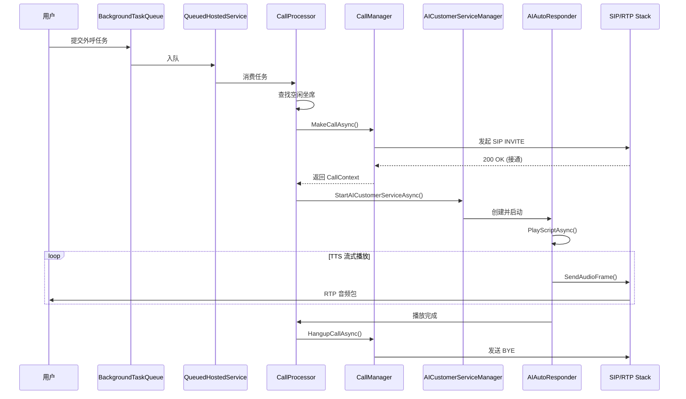
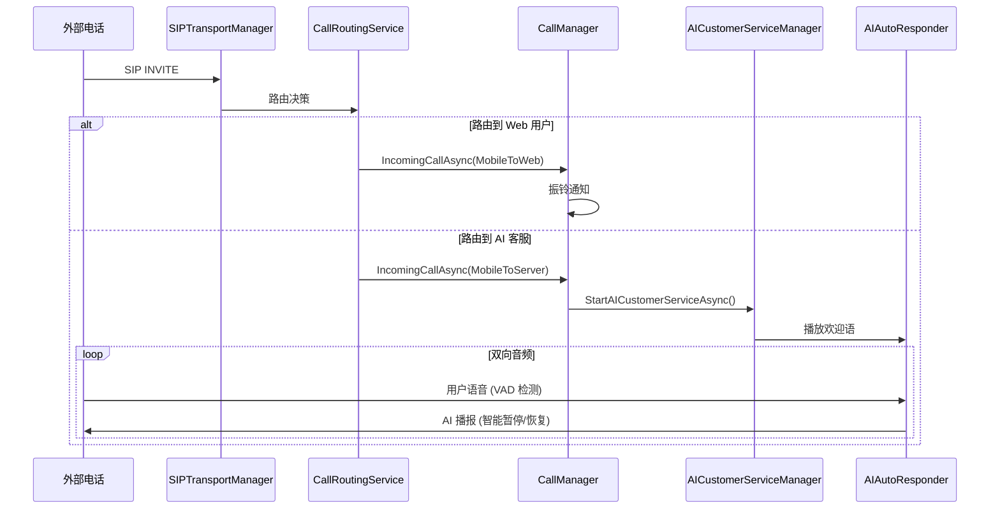

# AI.Caller

一个基于 .NET 8 的企业级智能 SIP 电话系统，集成了 AI 驱动的自动外呼、智能应答和实时语音处理功能。

## 项目概述

AI.Caller 是一个生产级的 SIP 电话解决方案，核心特色是将 AI 能力深度集成到电话通信流程中。系统不仅提供完整的 Web 界面进行电话管理，更重要的是实现了智能化的外呼任务自动化和来电自动应答。

系统采用双层模块化架构：
- **AI.Caller.Core**：独立的 SIP 通信和音频处理核心库
- **AI.Caller.Phone**：基于 ASP.NET Core MVC 的 Web 应用

通过 `System.Threading.Channels` 实现的高性能后台任务队列，系统能够高效处理大规模批量外呼任务。

## 技术栈

### 核心框架
- **.NET 8.0** - 主要开发框架
- **ASP.NET Core MVC** - Web 应用框架
- **Entity Framework Core + SQLite** - 数据持久化
- **SignalR** - 实时双向通信

### 通信协议
- **SIPSorcery** - SIP/RTP 协议栈实现
- **WebRTC** - 浏览器端实时音视频通信
- **G.711 (PCMA/PCMU)** - 音频编解码标准

### AI 与音频处理
- **Sherpa-ONNX** - 语音活动检测 (VAD)
- **FFmpeg** - 音频重采样和格式转换
- **自定义 TTS 引擎** - 流式文本转语音合成
- **自适应 VAD 算法** - 双阈值 + 噪声底线自适应 + 去抖动

### 异步处理
- **System.Threading.Channels** - 高性能无锁队列
- **IHostedService** - 后台服务托管
- **ArrayPool** - 内存池优化

### 数据处理
- **ExcelMapper & NPOI & ClosedXML** - Excel 批量导入导出

## 主要功能

### 1. 多场景通话支持
系统支持 7 种通话场景的无缝切换：

| 场景 | 说明 | 实现类 |
|------|------|--------|
| Web ↔ Web | 浏览器之间的 WebRTC 通话 | `WebToWebScenario` |
| Web → Mobile | 浏览器呼叫外部 SIP 设备 | `WebToMobileScenario` |
| Mobile → Web | 外部 SIP 设备呼入浏览器 | `MobileToWebScenario` |
| Server → Web | AI 坐席呼叫浏览器用户 | `ServerToWebScenario` |
| Server → Mobile | AI 坐席呼叫外部设备 | `ServerToMobileScenario` |
| Web → Server | 浏览器呼叫 AI 坐席 | `WebToServerScenario` |
| Mobile → Server | 外部设备呼入 AI 坐席 | `MobileToServerScenario` |

**核心能力**：
- 实时通话状态监控（通过 SignalR 推送）
- 完整的通话控制（建立、应答、挂断、DTMF）
- 通话录音和回放
- SIP 客户端池化管理（`SIPClientPoolManager`）

### 2. AI 智能应答系统

#### 核心组件：AIAutoResponder
这是系统的核心 AI 引擎，实现了以下关键功能：

**流式 TTS 播放**
- 支持预缓冲机制（默认 3 个音频块）
- 流式合成降低首字延迟
- 可配置播放次数和间隔

**智能 VAD（语音活动检测）**
```
算法特点：
- 自适应噪声底线（EMA 平滑）
- 双阈值判决（进入阈值 6dB / 恢复阈值 3dB）
- 去抖动机制（100ms debounce）
- FFmpeg 预处理（高通滤波 120Hz）
```

当检测到用户说话时，AI 自动暂停播报；用户停止说话后，AI 自动恢复播放。

**Jitter Buffer 缓冲管理**
- 基于 `Channel<byte[]>` 的无锁队列
- 水位线控制（高水位 300 / 低水位 100）
- 自适应播放速率

**音频桥接（AudioBridge）**
- SIP 音频流 ↔ AI 处理模块的双向桥接
- G.711 编解码（PCMA/PCMU）
- 音频重采样（8kHz/16kHz/24kHz）

#### 来电路由系统（CallRoutingService）
- 基于被叫号码的智能路由
- 支持路由策略：
  - 路由到 Web 用户
  - 路由到 AI 客服（自动应答）
  - 外部转接
- 配置化路由规则

### 3. AI 外呼任务管理

#### 任务创建方式
**单个任务**：快速创建单个外呼任务，支持 TTS 模板变量替换

**批量任务**：
1. 选择 TTS 模板
2. 系统根据模板变量动态生成 Excel 模板
3. 填写 Excel（电话号码 + 变量值）
4. 上传后自动解析并创建任务队列

#### 后台任务处理架构
```
用户提交任务
    ↓
BackgroundTaskQueue (Channel-based)
    ↓
QueuedHostedService (持续消费)
    ↓
CallProcessor (任务协调器)
    ↓
├─ CallManager.MakeCallAsync (建立通话)
└─ AICustomerServiceManager.StartAI (启动 AI)
    ↓
AIAutoResponder (TTS 播放 + VAD 检测)
```

**关键特性**：
- 动态坐席调度：自动选择空闲 AI 坐席
- 任务状态管理：排队中 → 进行中 → 已完成/失败
- 批量任务控制：支持暂停/恢复/取消
- 失败重试机制

#### TTS 模板系统
- 支持变量占位符（如 `{CustomerName}`、`{OrderNumber}`）
- 可配置播放次数、间隔、语速
- 支持结束语（循环播放后的最终播报）

### 4. 实时音频处理

**性能优化**：
- `ArrayPool<byte>` 内存池减少 GC 压力
- 并行音频编码
- 音频重采样器缓存（`ConcurrentDictionary`）

**音频处理流程**：
```
TTS 引擎 → 流式合成（float[]）
    ↓
AudioResampler（重采样到 8kHz）
    ↓
G711Codec（编码为 PCMA/PCMU）
    ↓
Jitter Buffer（平滑播放）
    ↓
RTP 发送
```

### 5. 基础管理功能
- **用户认证**：基于 Cookie 的认证系统
- **SIP 账户管理**：多账户配置和管理
- **TTS 模板管理**：CRUD 操作 + 变量定义
- **通话记录**：完整的呼叫日志和状态追踪
- **铃声管理**：自定义铃声上传和配置

## 项目结构

```
AI.Caller/
├── src/
│   ├── AI.Caller.Core/              # 核心 SIP 和音频处理库
│   │   ├── CallAutomation/          # AI 自动应答核心逻辑
│   │   │   └── AIAutoResponder.cs   # AI 自动应答器（TTS 播放、VAD 检测）
│   │   ├── Media/                   # 音频处理模块
│   │   │   ├── AudioBridge.cs       # 音频桥接（SIP ↔ AI）
│   │   │   ├── AudioResampler.cs    # 音频重采样
│   │   │   ├── Encoders/            # G.711 编解码器
│   │   │   ├── Vad/                 # 语音活动检测
│   │   │   └── Asr/                 # 语音识别（预留）
│   │   ├── Network/                 # 网络监控服务
│   │   ├── SIPClient.cs             # SIP 客户端封装
│   │   ├── SIPClientPoolManager.cs  # SIP 客户端池管理
│   │   ├── MediaSessionManager.cs   # 媒体会话管理（RTP/WebRTC）
│   │   └── SIPTransportManager.cs   # SIP 传输层管理
│   │
│   └── AI.Caller.Phone/             # Web 应用程序
│       ├── Controllers/             # MVC 控制器
│       ├── Services/                # 业务服务层
│       │   ├── ICallManager.cs      # 通话管理服务（含实现）
│       │   ├── AICustomerServiceManager.cs  # AI 客服管理
│       │   ├── CallProcessor.cs     # 外呼任务处理器
│       │   └── BackgroundTaskQueue.cs       # 后台任务队列
│       ├── CallRouting/             # 来电路由服务
│       ├── BackgroundTask/          # 后台服务
│       ├── Hubs/                    # SignalR 实时通信
│       ├── Entities/                # 数据模型
│       └── Views/                   # MVC 视图
│
├── tests/                           # 单元测试项目
└── deploy/                          # 部署文件
```

## 架构设计

### 核心架构原则

#### 1. 分层架构
```
┌─────────────────────────────────────────┐
│  表示层 (Presentation Layer)            │
│  ASP.NET Core MVC + SignalR             │
├─────────────────────────────────────────┤
│  业务逻辑层 (Business Logic Layer)      │
│  Services (CallManager, AIManager, etc) │
├─────────────────────────────────────────┤
│  数据访问层 (Data Access Layer)         │
│  Entity Framework Core + SQLite         │
├─────────────────────────────────────────┤
│  基础设施层 (Infrastructure Layer)      │
│  SIP Stack, Audio Processing, Network   │
└─────────────────────────────────────────┘
```

#### 2. 模块化设计
- **AI.Caller.Core**：独立的核心库，可被其他项目引用
  - 零 Web 依赖
  - 纯粹的 SIP 和音频处理逻辑
- **AI.Caller.Phone**：Web 应用层
  - 依赖 Core 库
  - 提供 UI 和业务编排

#### 3. 依赖注入与控制反转
所有服务通过 DI 容器管理，关键接口抽象：
- `ICallManager` - 通话管理
- `IBackgroundTaskQueue` - 任务队列
- `ICallProcessor` - 任务处理器
- `IAIAutoResponderFactory` - AI 应答器工厂
- `ICallRoutingService` - 来电路由

### 关键组件详解

#### 1. CallManager（通话管理器）
**职责**：管理通话的完整生命周期

```csharp
public interface ICallManager {
    Task<CallContext> MakeCallAsync(string destination, User caller, 
                                     RTCSessionDescriptionInit? offer, 
                                     CallScenario scenario);
    Task<bool> IncomingCallAsync(SIPRequest sipRequest, 
                                  CallRoutingResult routingResult);
    Task HangupCallAsync(string callId, int hangupUser);
    Task AnswerAsync(string callId, RTCSessionDescriptionInit? answer);
    Task SendDtmfAsync(byte tone, int sendUser, string callId);
}
```

**核心功能**：
- 维护活跃通话上下文（`ConcurrentDictionary<string, CallContext>`）
- 协调不同通话场景的处理逻辑
- 管理 SIP 客户端的分配和释放
- 集成录音管理器

#### 2. AICustomerServiceManager（AI 客服管理器）
**职责**：管理 AI 自动应答实例的生命周期

```csharp
public class AICustomerServiceManager {
    Task<bool> StartAICustomerServiceAsync(User user, 
                                           SIPClient sipClient, 
                                           string scriptText);
    Task StopAICustomerServiceAsync(int userId);
}
```

**工作流程**：
1. 创建 `AIAutoResponder` 实例
2. 初始化 `AudioBridge` 并连接音频流
3. 订阅音频事件（`OutgoingAudioGenerated`、`IncomingAudioReceived`）
4. 启动 TTS 播放任务
5. 管理会话状态（`ConcurrentDictionary<int, AIAutoResponderSession>`）

#### 3. CallProcessor（任务处理器）
**职责**：协调外呼任务的执行

```csharp
public async Task ProcessCallLogJob(int callLogId) {
    // 1. 查找空闲 AI 坐席
    var agent = await FindIdleAgent();
    
    // 2. 发起呼叫
    var callContext = await _callManager.MakeCallAsync(...);
    
    // 3. 等待接通
    // 4. 启动 AI 客服
    await _aiManager.StartAICustomerServiceAsync(...);
    
    // 5. 等待通话结束
    // 6. 更新任务状态
}
```

**关键逻辑**：
- 动态坐席调度（排除正在通话的坐席）
- 任务状态管理（Queued → InProgress → Completed/Failed）
- 异常处理和失败原因记录

#### 4. BackgroundTaskQueue（后台任务队列）
**实现**：基于 `System.Threading.Channels` 的有界队列

```csharp
public class BackgroundTaskQueue : IBackgroundTaskQueue {
    private readonly Channel<Func<CancellationToken, IServiceProvider, Task>> _queue;
    
    public BackgroundTaskQueue(int capacity) {
        var options = new BoundedChannelOptions(capacity) {
            FullMode = BoundedChannelFullMode.Wait
        };
        _queue = Channel.CreateBounded<...>(options);
    }
}
```

**特点**：
- 无锁高性能队列
- 容量限制（默认 100）
- 背压控制（队列满时等待）

#### 5. QueuedHostedService（后台服务）
**职责**：持续消费任务队列

```csharp
protected override async Task ExecuteAsync(CancellationToken stoppingToken) {
    while (!stoppingToken.IsCancellationRequested) {
        var workItem = await TaskQueue.DequeueAsync(stoppingToken);
        
        using (var scope = _serviceProvider.CreateScope()) {
            await workItem(stoppingToken, scope.ServiceProvider);
        }
    }
}
```

#### 6. SIPClientPoolManager（SIP 客户端池）
**职责**：管理 SIP 客户端的复用

- 维护客户端连接池
- 支持客户端的获取、释放和复用
- 自动管理客户端生命周期
- 支持多 SIP 服务器配置

#### 7. MediaSessionManager（媒体会话管理器）
**职责**：管理 RTP 和 WebRTC 媒体会话

- 管理 `VoIPMediaSession`（SIP/RTP）
- 管理 `RTCPeerConnection`（WebRTC）
- 处理 SDP 协商和 ICE 候选交换
- 支持音频桥接（SIP ↔ WebRTC）

### 数据流详解

#### 外呼任务完整流程



**关键步骤**：
1. **任务入队**：用户提交任务到 `BackgroundTaskQueue`
2. **坐席调度**：`CallProcessor` 查找空闲 AI 坐席
3. **发起呼叫**：`CallManager` 通过 SIP 协议栈发起 INVITE
4. **等待接通**：监听 `CallAnswered` 事件
5. **启动 AI**：`AICustomerServiceManager` 创建 `AIAutoResponder`
6. **TTS 播放**：流式合成并发送音频帧
7. **VAD 检测**：实时检测用户语音，智能暂停/恢复
8. **通话结束**：播放完成后挂断，更新任务状态

#### 来电路由流程



#### 音频处理流程

```
┌─────────────────────────────────────────────────────┐
│                   TTS 引擎                           │
│              (流式合成 float[] 32kHz)                │
└────────────────────┬────────────────────────────────┘
                     │
                     ▼
┌─────────────────────────────────────────────────────┐
│              AudioResampler                          │
│           (重采样到 8kHz PCM16)                      │
└────────────────────┬────────────────────────────────┘
                     │
                     ▼
┌─────────────────────────────────────────────────────┐
│               G711Codec                              │
│          (编码为 PCMA/PCMU)                          │
└────────────────────┬────────────────────────────────┘
                     │
                     ▼
┌─────────────────────────────────────────────────────┐
│            Jitter Buffer                             │
│      (Channel<byte[]> 平滑播放)                      │
└────────────────────┬────────────────────────────────┘
                     │
                     ▼
┌─────────────────────────────────────────────────────┐
│          MediaSessionManager                         │
│           (RTP 封包发送)                             │
└─────────────────────────────────────────────────────┘
```

**上行音频处理**（用户 → AI）：
```
RTP 接收 → G.711 解码 → AudioBridge.ProcessIncomingAudio 
→ AIAutoResponder.OnUplinkPcmFrame → VAD.Update 
→ 判断是否暂停播放
```

## 架构亮点

### 1. 高性能异步处理
- **无锁队列**：基于 `System.Threading.Channels` 实现零锁竞争
- **背压控制**：有界队列防止内存溢出
- **并发处理**：`IHostedService` 持续消费任务
- **内存优化**：`ArrayPool<byte>` 减少 GC 压力

### 2. 服务职责清晰
```
CallManager          → 通话"管道"管理（建立、维护、销毁）
AICustomerServiceManager → AI 能力注入（TTS、VAD）
CallProcessor        → 任务调度协调器
CallRoutingService   → 来电路由决策
```

### 3. 依赖倒置原则
通过接口抽象实现松耦合：
- `ICallManager` - 通话管理抽象
- `IBackgroundTaskQueue` - 任务队列抽象
- `IAIAutoResponderFactory` - AI 应答器工厂抽象
- `ITTSEngine` - TTS 引擎抽象

便于单元测试和功能替换。

### 4. 资源池化管理
- **SIP 客户端池**：复用连接，减少建立开销
- **音频重采样器缓存**：`ConcurrentDictionary` 缓存不同采样率的重采样器
- **内存池**：`ArrayPool<byte>` 复用字节数组

### 5. 实时音频优化

#### Jitter Buffer 设计
```csharp
private readonly Channel<byte[]> _jitterBuffer;
private const int JitterBufferWaterline = 300;  // 高水位
private const int LowWatermark = 100;           // 低水位
```

**工作原理**：
- 预缓冲 300 个音频帧后开始播放
- 低于 100 帧时自动加速播放（1.2x）
- 高于 300 帧时自动减速播放（0.8x）

#### VAD 自适应算法
```csharp
// 自适应噪声底线
_noiseFloor = (1 - _emaAlpha) * _noiseFloor + _emaAlpha * rms;

// 双阈值判决
float enterThresh = _noiseFloor * DbToLin(6f);   // 进入阈值
float resumeThresh = _noiseFloor * DbToLin(3f);  // 恢复阈值

// 去抖动
if ((now - _lastVadStateChange).TotalMilliseconds >= 100ms)
```

#### 并行音频编码
```csharp
Parallel.For(0, frameCount, i => {
    var frame = ExtractFrame(pcmData, i);
    encodedFrames[i] = _g711Codec.EncodeALaw(frame);
});
```

### 6. 灵活的场景模式
通过策略模式实现 7 种通话场景的独立处理：
- 每个场景独立处理 SDP 协商
- 独立的媒体流管理
- 便于扩展新场景

### 7. 可扩展性设计
- **预留 ASR 接口**：`src/AI.Caller.Core/Media/Asr/`
- **模块化音频处理**：编解码器、重采样器、VAD 均可独立替换
- **插件化 TTS 引擎**：通过 `ITTSEngine` 接口支持多种 TTS 实现

## 性能指标

### 音频处理性能
- **TTS 首字延迟**：< 200ms（流式合成 + 预缓冲）
- **VAD 响应时间**：100ms（debounce 时间）
- **音频帧处理**：20ms/帧（8kHz 采样率）
- **Jitter Buffer 延迟**：60-300ms（自适应）

### 系统吞吐量
- **并发通话数**：取决于 SIP 客户端池大小和服务器资源
- **任务队列容量**：100（可配置）
- **批量任务处理**：异步处理，不阻塞 Web 请求

### 资源占用
- **内存优化**：ArrayPool 减少 GC 压力
- **CPU 优化**：并行音频编码
- **网络优化**：G.711 低带宽编码（64 kbps）

## 未来演进方向

### 短期目标（已预留接口）
- [x] 单向 AI 语音播放
- [x] VAD 智能检测
- [ ] **语音识别 (ASR)**：集成 Sherpa-ONNX ASR 模型
- [ ] **语音转文本**：实时转录用户语音

### 中期目标
- [ ] **自然语言理解 (NLU)**：理解用户意图
- [ ] **对话管理 (Dialogue Manager)**：多轮对话状态机
- [ ] **知识库集成**：FAQ 问答系统

### 长期目标
- [ ] **情感识别**：分析用户情绪
- [ ] **多语言支持**：中英文混合识别
- [ ] **实时翻译**：跨语言通话
- [ ] **通话质量分析**：MOS 评分、静音检测

## 已知限制

1. **单向对话**：当前仅支持 AI 单向播报 + VAD 检测，不支持语音识别
2. **TTS 引擎**：需要自行集成 TTS 服务（代码中通过 `ITTSEngine` 接口抽象）
3. **并发限制**：受 SIP 客户端池大小限制
4. **网络依赖**：需要稳定的网络环境保证音频质量

## 快速开始

### 环境要求

- **.NET 8.0 SDK** - [下载地址](https://dotnet.microsoft.com/download/dotnet/8.0)
- **Visual Studio 2022** 或 **VS Code**
- **FFmpeg** - 用于音频处理（需配置路径）

### 安装步骤

#### 1. 克隆项目
```bash
git clone https://github.com/wolfweb/wolfweb-AI.Caller.git
cd AI.Caller
```

#### 2. 还原依赖包
```bash
dotnet restore
```

#### 3. 配置 FFmpeg
在 `src/AI.Caller.Phone/appsettings.json` 中配置 FFmpeg 路径：
```json
{
  "FFmpegDir": "C:\\path\\to\\ffmpeg\\bin"
}
```

#### 4. 配置管理员账户
在 `src/AI.Caller.Phone/appsettings.json` 中配置默认管理员：
```json
{
  "UserSettings": {
    "DefaultUser": {
      "Username": "admin",
      "Password": "your-strong-password"
    }
  }
}
```

#### 5. 配置 SIP 设置（可选）
```json
{
  "SipSettings": {
    "ContactHost": "your-server-ip-or-domain"
  }
}
```

#### 6. 配置 WebRTC（可选）
```json
{
  "WebRTCSettings": {
    "IceServers": [
      {
        "Urls": ["stun:stun.l.google.com:19302"]
      }
    ]
  }
}
```

#### 7. 配置 TTS 引擎
```json
{
  "TTSSettings": {
    "ApiUrl": "http://your-tts-service/api/tts",
    "DefaultSpeakerId": 0,
    "DefaultSpeed": 1.0
  }
}
```

> **注意**：项目中 TTS 引擎通过 `ITTSEngine` 接口抽象，需要自行实现或集成第三方 TTS 服务。

#### 8. 运行项目
```bash
cd src/AI.Caller.Phone
dotnet run
```

或者在 Visual Studio 中直接按 F5 运行。

#### 9. 访问应用
打开浏览器访问：
- **HTTPS**: `https://localhost:5001`
- **HTTP**: `http://localhost:5000`

使用配置的管理员账户登录。

### 首次使用指南

#### 1. 配置 SIP 账户
登录后，进入 **账户管理 → SIP 账户管理**，添加 SIP 服务器配置：
- SIP 服务器地址
- SIP 用户名
- SIP 密码

#### 2. 创建 TTS 模板
进入 **TTS 模板管理**，创建外呼脚本模板：
```
您好{CustomerName}，您的订单{OrderNumber}已发货，预计{DeliveryDate}送达。
```

定义变量：
- `CustomerName` - 客户姓名
- `OrderNumber` - 订单号
- `DeliveryDate` - 配送日期

#### 3. 配置 AI 客服
进入 **AI 客服设置**：
- 启用 AI 客服
- 设置默认欢迎语
- 选择默认 TTS 模板（用于来电自动应答）

#### 4. 创建外呼任务

**单个任务**：
1. 进入 **外呼任务管理 → 创建单个任务**
2. 输入电话号码
3. 选择 TTS 模板
4. 填写变量值
5. 提交任务

**批量任务**：
1. 进入 **外呼任务管理 → 创建批量任务**
2. 选择 TTS 模板
3. 下载 Excel 模板
4. 填写电话号码和变量值
5. 上传 Excel 文件
6. 系统自动创建任务队列

#### 5. 监控任务状态
在 **外呼任务管理** 页面查看：
- 排队中的任务
- 进行中的任务
- 已完成的任务
- 失败的任务（含失败原因）

## 常见问题

### Q: 如何集成自己的 TTS 服务？
A: 实现 `ITTSEngine` 接口：
```csharp
public interface ITTSEngine {
    IAsyncEnumerable<AudioData> SynthesizeStreamAsync(
        string text, 
        int speakerId = 0, 
        float speed = 1.0f
    );
}
```

在 `Program.cs` 中注册：
```csharp
builder.Services.AddSingleton<ITTSEngine, YourTTSImplementation>();
```

### Q: 如何调整并发通话数？
A: 修改 SIP 客户端池大小和任务队列容量：
```csharp
// Program.cs
builder.Services.AddSingleton<IBackgroundTaskQueue>(
    sp => new BackgroundTaskQueue(200)  // 增加队列容量
);
```

### Q: VAD 检测不准确怎么办？
A: 调整 VAD 参数：
```csharp
vad.Configure(
    energyThreshold: 0.01f,      // 能量阈值
    enterSpeakingMs: 200,        // 进入说话状态所需时间
    resumeSilenceMs: 600,        // 恢复静音状态所需时间
    sampleRate: 16000,
    frameMs: 20
);
```

### Q: 如何启用通话录音？
A: 在通话管理页面配置录音设置，系统会自动录制通话并保存到 `recordings/` 目录。

### Q: 支持哪些 SIP 服务器？
A: 理论上支持所有标准 SIP 服务器（如 Asterisk、FreeSWITCH、Kamailio 等）。

## 故障排查

### 问题：通话无声音
**可能原因**：
1. FFmpeg 路径配置错误
2. 音频编解码器不匹配
3. 防火墙阻止 RTP 端口

**解决方案**：
- 检查 FFmpeg 配置
- 查看日志中的音频处理错误
- 开放 RTP 端口范围（默认 10000-20000）

### 问题：AI 客服不自动应答
**可能原因**：
1. AI 客服未启用
2. 来电路由配置错误
3. TTS 服务不可用

**解决方案**：
- 检查 AI 客服设置
- 查看来电路由日志
- 测试 TTS 服务连接

### 问题：批量任务不执行
**可能原因**：
1. 没有可用的 AI 坐席
2. 任务队列已满
3. 后台服务未启动

**解决方案**：
- 检查 SIP 账户配置
- 增加队列容量
- 查看 `QueuedHostedService` 日志

## 贡献指南

欢迎贡献代码！请遵循以下步骤：

1. Fork 项目
2. 创建功能分支 (`git checkout -b feature/AmazingFeature`)
3. 提交更改 (`git commit -m 'Add some AmazingFeature'`)
4. 推送到分支 (`git push origin feature/AmazingFeature`)
5. 创建 Pull Request

### 代码规范
- 遵循 C# 编码规范
- 添加必要的注释和文档
- 编写单元测试
- 确保所有测试通过

## 许可证

本项目采用 MIT 许可证。详见 [LICENSE](LICENSE) 文件。

## 致谢

- [SIPSorcery](https://github.com/sipsorcery-org/sipsorcery) - 优秀的 SIP 协议栈
- [Sherpa-ONNX](https://github.com/k2-fsa/sherpa-onnx) - 高性能语音处理库
- [FFmpeg](https://ffmpeg.org/) - 强大的音视频处理工具

## 联系方式

- **项目主页**: https://github.com/wolfweb/wolfweb-AI.Caller
- **问题反馈**: https://github.com/wolfweb/wolfweb-AI.Caller/issues

---

**注意**：本项目仅供学习和研究使用，请遵守当地法律法规，不得用于非法用途。
