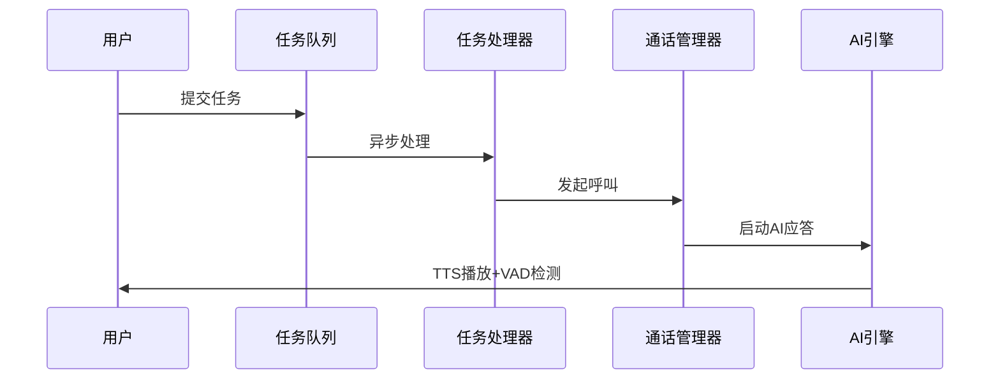
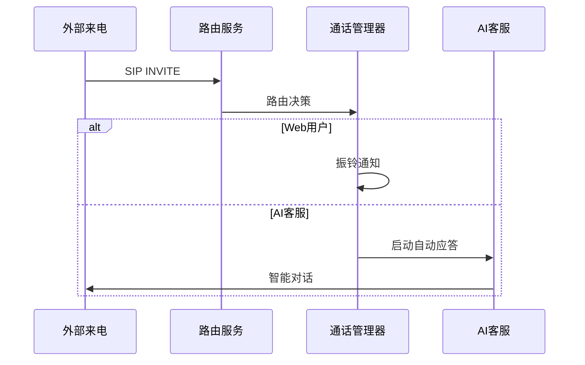

# AI.Caller

[](https://dotnet.microsoft.com/)
[](https://opensource.org/licenses/MIT)
[](https://docs.microsoft.com/en-us/dotnet/csharp/)

一个基于 .NET 8 的企业级智能 SIP 电话系统，集成了 AI 驱动的自动外呼、智能应答和实时语音处理功能。

## 项目概述

**AI.Caller** 是一个基于 .NET 8 的企业级智能 SIP 电话系统，将 AI 技术深度集成到电话通信流程，实现自动化外呼和智能应答。

### 核心特性
- 🤖 **AI 智能应答**：内置 Sherpa-ONNX TTS/VAD，实时语音检测和智能播报
- 📞 **多场景通话**：支持 7 种通话模式（Web↔Web、Web↔Mobile、Server↔AI 等）
- 📊 **批量任务管理**：高性能异步队列，支持大规模外呼任务调度
- 🌐 **SIP 线路管理**：多线路配置，智能路由选择
- 🎛️ **实时监控**：SignalR 双向通信，实时通话状态推送

### 架构设计
采用双层模块化架构：
- **AI.Caller.Core**：核心 SIP 通信和音频处理库（可独立引用）
- **AI.Caller.Phone**：ASP.NET Core MVC Web 应用层

基于 `System.Threading.Channels` 实现无锁高性能任务队列，确保大规模并发处理能力。

## 目录

- [技术栈](#技术栈)
- [主要功能](#主要功能)
- [项目结构](#项目结构)
- [架构设计](#架构设计)
- [性能指标](#性能指标)
- [快速开始](#快速开始)
- [API 文档](#api-文档)
- [常见问题](#常见问题)
- [故障排查](#故障排查)
- [贡献指南](#贡献指南)
- [更新日志](#更新日志)
- [许可证](#许可证)

## 技术栈

### 核心框架
- **.NET 8.0** - 主要开发框架
- **ASP.NET Core MVC** - Web 应用框架
- **Entity Framework Core + SQLite** - 数据持久化
- **SignalR** - 实时双向通信

### 通信协议
- **SIPSorcery** - SIP/RTP 协议栈实现
- **WebRTC** - 浏览器端实时音视频通信
- **G.711 (PCMA/PCMU)** - 音频编解码标准

### AI 与音频处理
- **Sherpa-ONNX** - 语音活动检测 (VAD) 和离线 TTS 引擎
- **FFmpeg** - 音频重采样和格式转换
- **内置 TTS 引擎** - 基于 Sherpa-ONNX 的流式文本转语音合成
- **自适应 VAD 算法** - 双阈值 + 噪声底线自适应 + 去抖动

### 异步处理
- **System.Threading.Channels** - 高性能无锁队列
- **IHostedService** - 后台服务托管
- **ArrayPool** - 内存池优化

### 数据处理
- **ExcelMapper & NPOI & ClosedXML** - Excel 批量导入导出

## 主要功能

### 1. 多场景通话支持
系统支持 7 种通话场景的无缝切换：

| 场景 | 说明 | 实现类 |
|------|------|--------|
| Web ↔ Web | 浏览器之间的 WebRTC 通话 | `WebToWebScenario` |
| Web → Mobile | 浏览器呼叫外部 SIP 设备 | `WebToMobileScenario` |
| Mobile → Web | 外部 SIP 设备呼入浏览器 | `MobileToWebScenario` |
| Server → Web | AI 坐席呼叫浏览器用户 | `ServerToWebScenario` |
| Server → Mobile | AI 坐席呼叫外部设备 | `ServerToMobileScenario` |
| Web → Server | 浏览器呼叫 AI 坐席 | `WebToServerScenario` |
| Mobile → Server | 外部设备呼入 AI 坐席 | `MobileToServerScenario` |

**核心能力**：
- 实时通话状态监控（通过 SignalR 推送）
- 完整的通话控制（建立、应答、挂断、DTMF）
- 通话录音和回放
- SIP 客户端池化管理（`SIPClientPoolManager`）

### 2. AI 智能应答系统

#### 核心组件：AIAutoResponder
这是系统的核心 AI 引擎，实现了以下关键功能：

**流式 TTS 播放**
- 支持预缓冲机制（默认 3 个音频块）
- 流式合成降低首字延迟
- 可配置播放次数和间隔

**智能 VAD（语音活动检测）**
```
算法特点：
- 自适应噪声底线（EMA 平滑）
- 双阈值判决（进入阈值 6dB / 恢复阈值 3dB）
- 去抖动机制（100ms debounce）
- FFmpeg 预处理（高通滤波 120Hz）
```

当检测到用户说话时，AI 自动暂停播报；用户停止说话后，AI 自动恢复播放。

**Jitter Buffer 缓冲管理**
- 基于 `Channel<byte[]>` 的无锁队列
- 水位线控制（高水位 300 / 低水位 100）
- 自适应播放速率

**音频桥接（AudioBridge）**
- SIP 音频流 ↔ AI 处理模块的双向桥接
- G.711 编解码（PCMA/PCMU）
- 音频重采样（8kHz/16kHz/24kHz）

#### 来电路由系统（CallRoutingService）
- 基于被叫号码的智能路由
- 支持路由策略：
  - 路由到 Web 用户
  - 路由到 AI 客服（自动应答）
  - 外部转接
- 配置化路由规则

### 3. AI 外呼任务管理

#### 任务创建方式
**单个任务**：快速创建单个外呼任务，支持 TTS 模板变量替换

**批量任务**：
1. 选择 TTS 模板
2. 系统根据模板变量动态生成 Excel 模板
3. 填写 Excel（电话号码 + 变量值）
4. 上传后自动解析并创建任务队列

#### 后台任务处理架构
```
用户提交任务
    ↓
BackgroundTaskQueue (Channel-based)
    ↓
QueuedHostedService (持续消费)
    ↓
CallProcessor (任务协调器)
    ↓
├─ CallManager.MakeCallAsync (建立通话)
└─ AICustomerServiceManager.StartAI (启动 AI)
    ↓
AIAutoResponder (TTS 播放 + VAD 检测)
```

**关键特性**：
- 动态坐席调度：自动选择空闲 AI 坐席
- 任务状态管理：排队中 → 进行中 → 已完成/失败
- 批量任务控制：支持暂停/恢复/取消
- 失败重试机制

#### TTS 模板系统
- 支持变量占位符（如 `{CustomerName}`、`{OrderNumber}`）
- 可配置播放次数、间隔、语速
- 支持结束语（循环播放后的最终播报）

### 4. 实时音频处理

**性能优化**：
- `ArrayPool<byte>` 内存池减少 GC 压力
- 并行音频编码
- 音频重采样器缓存（`ConcurrentDictionary`）

**音频处理流程**：
```
TTS 引擎 → 流式合成（float[]）
    ↓
AudioResampler（重采样到 8kHz）
    ↓
G711Codec（编码为 PCMA/PCMU）
    ↓
Jitter Buffer（平滑播放）
    ↓
RTP 发送
```

### 5. SIP 线路管理

#### 核心功能
系统支持多 SIP 线路配置，实现注册服务器与呼叫服务器的解耦：

**线路配置**
- 支持配置多个 SIP 代理服务器（Proxy Server）
- 可选配置出站代理（Outbound Proxy）
- 线路优先级管理（Priority）
- 区域标识和描述信息
- 线路激活/停用控制

**智能线路选择**
- **自动选择**：根据优先级自动选择最佳线路
- **手动指定**：用户可为每个呼叫指定特定线路
- **默认线路**：为 SIP 账户设置默认呼叫线路
- **账户关联**：支持 SIP 账户与多条线路的关联管理

**路由策略**
```csharp
// 线路选择优先级
1. 用户指定的首选线路 (preferredLineId)
2. 账户配置的默认线路 (DefaultLine)
3. 自动选择最高优先级可用线路
4. 降级使用账户的注册服务器 (SipServer)
```

**API 支持**
- 完整的线路 CRUD 操作
- 账户-线路关联管理
- 默认线路设置
- 线路状态监控

### 6. 基础管理功能
- **用户认证**：基于 Cookie 的认证系统
- **SIP 账户管理**：多账户配置和管理
- **TTS 模板管理**：CRUD 操作 + 变量定义
- **通话记录**：完整的呼叫日志和状态追踪
- **铃声管理**：自定义铃声上传和配置

## 项目结构

```
AI.Caller/
├── src/
│   ├── AI.Caller.Core/              # 核心 SIP 和音频处理库
│   │   ├── CallAutomation/          # AI 自动应答核心逻辑
│   │   │   └── AIAutoResponder.cs   # AI 自动应答器（TTS 播放、VAD 检测）
│   │   ├── Media/                   # 音频处理模块
│   │   │   ├── AudioBridge.cs       # 音频桥接（SIP ↔ AI）
│   │   │   ├── AudioResampler.cs    # 音频重采样
│   │   │   ├── Encoders/            # G.711 编解码器
│   │   │   ├── Vad/                 # 语音活动检测
│   │   │   └── Asr/                 # 语音识别（预留）
│   │   ├── Network/                 # 网络监控服务
│   │   ├── SIPClient.cs             # SIP 客户端封装
│   │   ├── SIPClientPoolManager.cs  # SIP 客户端池管理
│   │   ├── MediaSessionManager.cs   # 媒体会话管理（RTP/WebRTC）
│   │   └── SIPTransportManager.cs   # SIP 传输层管理
│   │
│   └── AI.Caller.Phone/             # Web 应用程序
│       ├── Controllers/             # MVC 控制器
│       │   └── Api/                 # API 控制器
│       │       └── SipLineController.cs  # SIP线路管理API
│       ├── Services/                # 业务服务层
│       │   ├── ICallManager.cs      # 通话管理服务（含实现）
│       │   ├── AICustomerServiceManager.cs  # AI 客服管理
│       │   ├── CallProcessor.cs     # 外呼任务处理器
│       │   ├── BackgroundTaskQueue.cs       # 后台任务队列
│       │   ├── ISipLineSelector.cs   # SIP线路选择器
│       │   └── SipLineSelector.cs    # SIP线路选择器实现
│       ├── CallRouting/             # 来电路由服务
│       ├── BackgroundTask/          # 后台服务
│       ├── Hubs/                    # SignalR 实时通信
│       ├── Entities/                # 数据模型
│       └── Views/                   # MVC 视图
│
├── tests/                           # 单元测试项目
└── deploy/                          # 部署文件
```

## 架构设计

### 系统架构

采用经典的分层架构设计，确保职责分离和高可维护性：

```
┌─────────────────────────────────────────┐
│  表示层 (Presentation Layer)            │
│  ASP.NET Core MVC + SignalR + WebRTC    │
├─────────────────────────────────────────┤
│  业务逻辑层 (Business Logic Layer)      │
│  Services + Domain Logic                │
├─────────────────────────────────────────┤
│  数据访问层 (Data Access Layer)         │
│  Entity Framework Core + SQLite         │
├─────────────────────────────────────────┤
│  基础设施层 (Infrastructure Layer)      │
│  SIP Stack, Audio Processing, AI Engine │
└─────────────────────────────────────────┘
```

### 核心设计原则

#### 🏗️ **模块化设计**
- **AI.Caller.Core**：核心通信和音频处理库
  - 零外部依赖，可独立部署
  - 专注底层通信和媒体处理
- **AI.Caller.Phone**：Web 应用层
  - 提供用户界面和管理功能
  - 编排业务流程和用户交互

#### 🔄 **依赖倒置**
通过接口抽象实现松耦合设计：
- `ICallManager` - 通话生命周期管理
- `ISipLineSelector` - 智能线路选择
- `ITTSEngine` - 语音合成引擎
- `IBackgroundTaskQueue` - 异步任务处理

### 核心组件

#### 🎯 **主要服务组件**
- **CallManager**：通话生命周期管理，协调 7 种通话场景
- **AICustomerServiceManager**：AI 自动应答实例管理
- **SipLineSelector**：智能 SIP 线路选择和路由
- **CallProcessor**：批量任务调度和执行
- **BackgroundTaskQueue**：基于 Channel 的高性能异步队列

#### 🔧 **基础设施组件**
- **SIPClientPoolManager**：连接池管理，优化资源使用
- **MediaSessionManager**：RTP/WebRTC 媒体会话处理
- **AudioBridge**：SIP ↔ AI 音频流双向桥接
- **TTSEngineAdapter**：Sherpa-ONNX TTS 引擎适配

### 核心数据流

#### 📞 **外呼任务流程**

```mermaid
sequenceDiagram
    participant U as 用户
    participant Q as 任务队列
    participant P as 任务处理器
    participant C as 通话管理器
    participant AI as AI引擎

    U->>Q: 提交任务
    Q->>P: 异步处理
    P->>C: 发起呼叫
    C->>AI: 启动AI应答
    AI->>U: TTS播放+VAD检测
```

#### 📱 **来电处理流程**

```mermaid
sequenceDiagram
    participant Ext as 外部来电
    participant R as 路由服务
    participant C as 通话管理器
    participant AI as AI客服

    Ext->>R: SIP INVITE
    R->>C: 路由决策
    alt Web用户
        C->>C: 振铃通知
    else AI客服
        C->>AI: 启动自动应答
        AI->>Ext: 智能对话
    end
```

#### 🎵 **音频处理管道**
```
TTS引擎 → 音频重采样 → G.711编码 → JitterBuffer → RTP发送
```

## 架构亮点

### ⚡ **高性能设计**
- **无锁异步队列**：基于 `System.Threading.Channels` 实现零竞争并发
- **智能资源池化**：SIP 客户端池 + 内存池优化，减少 GC 压力
- **自适应音频处理**：Jitter Buffer + VAD 算法确保通话质量

### 🏗️ **模块化架构**
- **双层分离**：Core 层专注通信逻辑，Phone 层处理业务编排
- **接口抽象**：依赖倒置原则，便于测试和扩展
- **策略模式**：7 种通话场景独立处理，支持灵活扩展

### 🔧 **核心优化技术**
- **并发处理**：`IHostedService` 持续任务消费
- **背压控制**：有界队列防止系统过载
- **并行编码**：音频处理性能优化
- **流式 TTS**：低延迟语音合成

## 性能指标

### 音频处理性能
- **TTS 首字延迟**：< 200ms（流式合成 + 预缓冲）
- **VAD 响应时间**：100ms（debounce 时间）
- **音频帧处理**：20ms/帧（8kHz 采样率）
- **Jitter Buffer 延迟**：60-300ms（自适应）

### 系统吞吐量
- **并发通话数**：取决于 SIP 客户端池大小和服务器资源
- **任务队列容量**：100（可配置）
- **批量任务处理**：异步处理，不阻塞 Web 请求

### 资源占用
- **内存优化**：ArrayPool 减少 GC 压力
- **CPU 优化**：并行音频编码
- **网络优化**：G.711 低带宽编码（64 kbps）

## 未来演进方向

### 短期目标（已预留接口）
- [x] 单向 AI 语音播放
- [x] VAD 智能检测
- [ ] **语音识别 (ASR)**：集成 Sherpa-ONNX ASR 模型
- [ ] **语音转文本**：实时转录用户语音

### 中期目标
- [ ] **自然语言理解 (NLU)**：理解用户意图
- [ ] **对话管理 (Dialogue Manager)**：多轮对话状态机
- [ ] **知识库集成**：FAQ 问答系统

### 长期目标
- [ ] **情感识别**：分析用户情绪
- [ ] **多语言支持**：中英文混合识别
- [ ] **实时翻译**：跨语言通话
- [ ] **通话质量分析**：MOS 评分、静音检测

## 已知限制

1. **单向对话**：当前仅支持 AI 单向播报 + VAD 检测，不支持语音识别
2. **TTS 模型**：需要下载 Sherpa-ONNX TTS 模型文件（系统已内置引擎实现）
3. **并发限制**：受 SIP 客户端池大小限制
4. **网络依赖**：需要稳定的网络环境保证音频质量

## 快速开始

### 系统要求

#### 硬件要求
- **操作系统**: Windows 10/11, Linux (Ubuntu 18.04+), macOS 10.15+
- **处理器**: Intel/AMD x64 或 ARM64 处理器
- **内存**: 至少 4GB RAM（推荐 8GB+ 用于并发通话）
- **存储**: 至少 2GB 可用磁盘空间
- **网络**: 稳定的互联网连接（推荐带宽 10Mbps+）

#### 软件要求
- **.NET 8.0 SDK** - [下载地址](https://dotnet.microsoft.com/download/dotnet/8.0)
- **Visual Studio 2022** 或 **VS Code** + C# 扩展
- **FFmpeg** - 用于音频处理（需配置路径）
- **Git** - 用于代码管理

### 安装步骤

#### 1. 克隆项目
```bash
git clone https://github.com/wolfweb/wolfweb-AI.Caller.git
cd AI.Caller
```

#### 2. 验证环境
```bash
# 验证 .NET SDK 版本
dotnet --version

# 验证 Git 版本
git --version
```

#### 3. 还原依赖包
```bash
dotnet restore
```

#### 4. 构建项目
```bash
# 构建项目
dotnet build

# 可选：运行测试
dotnet test
```

#### 5. 配置 FFmpeg
在 `src/AI.Caller.Phone/appsettings.json` 中配置 FFmpeg 路径：
```json
{
  "FFmpegDir": "C:\\path\\to\\ffmpeg\\bin"
}
```

#### 4. 配置管理员账户
在 `src/AI.Caller.Phone/appsettings.json` 中配置默认管理员：
```json
{
  "UserSettings": {
    "DefaultUser": {
      "Username": "admin",
      "Password": "your-strong-password"
    }
  }
}
```

#### 5. 配置 SIP 设置（可选）
```json
{
  "SipSettings": {
    "ContactHost": "your-server-ip-or-domain"
  }
}
```

#### 6. 配置 WebRTC（可选）
```json
{
  "WebRTCSettings": {
    "IceServers": [
      {
        "Urls": ["stun:stun.l.google.com:19302"]
      }
    ]
  }
}
```

#### 7. 配置 TTS 引擎
系统已内置基于 Sherpa-ONNX 的离线 TTS 引擎，需要下载相应的模型文件：

```json
{
  "TTSSettings": {
    "Enabled": true,
    "ModelFolder": "models/tts",
    "ModelFile": "vits-zh-aishell3.onnx",
    "LexiconFile": "lexicon.txt",
    "TokensFile": "tokens.txt",
    "DictDir": "dict",
    "NumThreads": 2,
    "Debug": false,
    "Provider": "cpu"
  }
}
```

> **注意**：需要下载 Sherpa-ONNX TTS 模型文件并放置在指定目录。系统已内置 TTS 引擎实现，无需额外集成。

#### 8. 运行项目
```bash
cd src/AI.Caller.Phone
dotnet run
```

或者在 Visual Studio 中直接按 F5 运行。

#### Docker 部署（可选）
```bash
# 构建镜像
docker build -t ai-caller .

# 运行容器
docker run -p 5000:80 -p 5001:443 \
  -e ASPNETCORE_ENVIRONMENT=Production \
  ai-caller
```

#### 9. 访问应用
打开浏览器访问：
- **HTTPS**: `https://localhost:5001`
- **HTTP**: `http://localhost:5000`

使用配置的管理员账户登录。

### 首次使用指南

#### 1. 配置 SIP 账户
登录后，进入 **账户管理 → SIP 账户管理**，添加 SIP 服务器配置：
- SIP 服务器地址
- SIP 用户名
- SIP 密码

#### 2. 创建 TTS 模板
进入 **TTS 模板管理**，创建外呼脚本模板：
```
您好{CustomerName}，您的订单{OrderNumber}已发货，预计{DeliveryDate}送达。
```

定义变量：
- `CustomerName` - 客户姓名
- `OrderNumber` - 订单号
- `DeliveryDate` - 配送日期

#### 3. 配置 AI 客服
进入 **AI 客服设置**：
- 启用 AI 客服
- 设置默认欢迎语
- 选择默认 TTS 模板（用于来电自动应答）

#### 4. 创建外呼任务

**单个任务**：
1. 进入 **外呼任务管理 → 创建单个任务**
2. 输入电话号码
3. 选择 TTS 模板
4. 填写变量值
5. 提交任务

**批量任务**：
1. 进入 **外呼任务管理 → 创建批量任务**
2. 选择 TTS 模板
3. 下载 Excel 模板
4. 填写电话号码和变量值
5. 上传 Excel 文件
6. 系统自动创建任务队列

#### 5. 监控任务状态
在 **外呼任务管理** 页面查看：
- 排队中的任务
- 进行中的任务
- 已完成的任务
- 失败的任务（含失败原因）

## API 文档

### 认证
所有 API 请求需要 Bearer token 认证：
```
Authorization: Bearer {your-jwt-token}
```

### 主要端点

#### SIP 线路管理
```http
GET    /api/SipLine                    # 获取所有线路
GET    /api/SipLine/{id}               # 获取指定线路
POST   /api/SipLine                    # 创建新线路
PUT    /api/SipLine/{id}               # 更新线路
DELETE /api/SipLine/{id}               # 删除线路
POST   /api/SipLine/set-default        # 设置默认线路
GET    /api/SipLine/account/{accountId}/lines  # 获取账户可用线路
```

#### 通话管理
```http
POST   /api/phone/call                # 发起呼叫
POST   /api/phone/hangup              # 挂断通话
POST   /api/phone/answer              # 接听来电
POST   /api/phone/send-dtmf           # 发送 DTMF 音
GET    /api/phone/status              # 获取通话状态
```

#### 任务管理
```http
GET    /api/CallTask                  # 获取任务列表
POST   /api/CallTask/single           # 创建单个任务
POST   /api/CallTask/batch            # 创建批量任务
PUT    /api/CallTask/{id}/pause       # 暂停任务
PUT    /api/CallTask/{id}/resume      # 恢复任务
DELETE /api/CallTask/{id}             # 删除任务
```

#### 数据示例
```json
// 创建 SIP 线路
POST /api/SipLine
{
  "name": "北京电信",
  "proxyServer": "sip.beijing.telecom.com",
  "outboundProxy": "outbound.telecom.com",
  "priority": 10,
  "region": "北京",
  "description": "北京地区电信线路",
  "isActive": true
}

// 发起呼叫
POST /api/phone/call
{
  "destination": "13800138000",
  "selectedLineId": 1,
  "autoSelectLine": true
}
```

## 常见问题

### Q: 如何配置 TTS 引擎？
A: 系统已内置 Sherpa-ONNX TTS 引擎，需要：

1. 下载 TTS 模型文件（.onnx 格式）
2. 在 `appsettings.json` 中配置模型路径
3. 确保模型文件放置在指定目录

```json
{
  "TTSSettings": {
    "Enabled": true,
    "ModelFolder": "models/tts",
    "ModelFile": "vits-zh-aishell3.onnx"
  }
}
```

如需自定义 TTS 实现，可实现 `ITTSEngine` 接口并注册到 DI 容器。

### Q: 如何调整并发通话数？
A: 修改 SIP 客户端池大小和任务队列容量：
```csharp
// Program.cs
builder.Services.AddSingleton<IBackgroundTaskQueue>(
    sp => new BackgroundTaskQueue(200)  // 增加队列容量
);
```

### Q: VAD 检测不准确怎么办？
A: 调整 VAD 参数：
```csharp
vad.Configure(
    energyThreshold: 0.01f,      // 能量阈值
    enterSpeakingMs: 200,        // 进入说话状态所需时间
    resumeSilenceMs: 600,        // 恢复静音状态所需时间
    sampleRate: 16000,
    frameMs: 20
);
```

### Q: 如何启用通话录音？
A: 在通话管理页面配置录音设置，系统会自动录制通话并保存到 `recordings/` 目录。

### Q: 支持哪些 SIP 服务器？
A: 理论上支持所有标准 SIP 服务器（如 Asterisk、FreeSWITCH、Kamailio 等）。

## 故障排查

### 问题：通话无声音
**可能原因**：
1. FFmpeg 路径配置错误
2. 音频编解码器不匹配
3. 防火墙阻止 RTP 端口

**解决方案**：
- 检查 FFmpeg 配置
- 查看日志中的音频处理错误
- 开放 RTP 端口范围（默认 10000-20000）

### 问题：AI 客服不自动应答
**可能原因**：
1. AI 客服未启用
2. 来电路由配置错误
3. TTS 服务不可用

**解决方案**：
- 检查 AI 客服设置
- 查看来电路由日志
- 测试 TTS 服务连接

### 问题：批量任务不执行
**可能原因**：
1. 没有可用的 AI 坐席
2. 任务队列已满
3. 后台服务未启动

**解决方案**：
- 检查 SIP 账户配置
- 增加队列容量
- 查看 `QueuedHostedService` 日志

## 贡献指南

欢迎贡献代码！请遵循以下步骤：

1. Fork 项目
2. 创建功能分支 (`git checkout -b feature/AmazingFeature`)
3. 提交更改 (`git commit -m 'Add some AmazingFeature'`)
4. 推送到分支 (`git push origin feature/AmazingFeature`)
5. 创建 Pull Request

### 开发环境设置
```bash
# 1. 克隆项目
git clone https://github.com/wolfweb/wolfweb-AI.Caller.git
cd AI.Caller

# 2. 安装依赖
dotnet restore

# 3. 运行测试
dotnet test

# 4. 启动开发服务器
cd src/AI.Caller.Phone
dotnet run
```

### 代码规范
- 遵循 C# 编码规范和 .NET 命名约定
- 添加必要的 XML 注释和文档
- 编写单元测试覆盖核心逻辑
- 使用异步编程模式
- 确保所有测试通过

## 许可证

本项目采用 MIT 许可证 - 详见 [LICENSE](LICENSE) 文件

```
MIT License

Copyright (c) 2024 AI.Caller

Permission is hereby granted, free of charge, to any person obtaining a copy
of this software and associated documentation files (the "Software"), to deal
in the Software without restriction, including without limitation the rights
to use, copy, modify, merge, publish, distribute, sublicense, and/or sell
copies of the Software, and to permit persons to whom the Software is
furnished to do so, subject to the following conditions:

The above copyright notice and this permission notice shall be included in all
copies or substantial portions of the Software.

THE SOFTWARE IS PROVIDED "AS IS", WITHOUT WARRANTY OF ANY KIND, EXPRESS OR
IMPLIED, INCLUDING BUT NOT LIMITED TO THE WARRANTIES OF MERCHANTABILITY,
FITNESS FOR A PARTICULAR PURPOSE AND NONINFRINGEMENT. IN NO EVENT SHALL THE
AUTHORS OR COPYRIGHT HOLDERS BE LIABLE FOR ANY CLAIM, DAMAGES OR OTHER
LIABILITY, WHETHER IN AN ACTION OF CONTRACT, TORT OR OTHERWISE, ARISING FROM,
OUT OF OR IN CONNECTION WITH THE SOFTWARE OR THE USE OR OTHER DEALINGS IN THE
SOFTWARE.
```

## 致谢

- [SIPSorcery](https://github.com/sipsorcery-org/sipsorcery) - 优秀的 SIP 协议栈
- [Sherpa-ONNX](https://github.com/k2-fsa/sherpa-onnx) - 高性能语音处理库
- [FFmpeg](https://ffmpeg.org/) - 强大的音视频处理工具

## 联系方式

- **项目主页**: https://github.com/wolfweb/wolfweb-AI.Caller
- **问题反馈**: https://github.com/wolfweb/wolfweb-AI.Caller/issues

---

**注意**：本项目仅供学习和研究使用，请遵守当地法律法规，不得用于非法用途。
